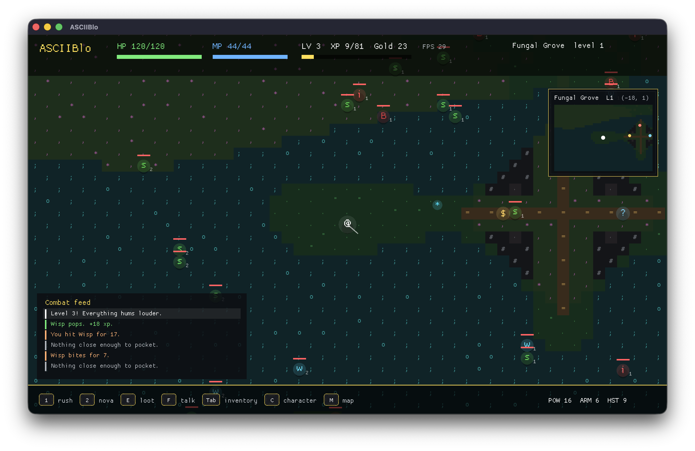

# ASCIIBlo



`ASCIIBlo` is a native Rust action RPG prototype with a graphical renderer inspired by ASCII games rather than constrained by the terminal.

Run it with:

```bash
cargo run
```

Generate deterministic UI previews without interacting with the live window:

```bash
cargo run -- --preview inventory --output /tmp/asciiblo-inventory.png
cargo run -- --preview-all /tmp/asciiblo-previews
```

Available single-screen preview modes currently include `gameplay`, `pickup`, `inventory`, `character`, `world-map`, `shop-buy`, `shop-sell`, `trainer`, and `travel`.

Controls:

- Move: `WASD`
- Aim: mouse
- Basic attack: left click or `Space`
- Skills: `1` for Rush, `2` for Nova
- Pick up loot: `E`
- Talk to NPCs: `F`
- Inventory: `Tab`, then `Up` / `Down` to move, `Enter` to equip, `Backspace` to drop
- Character sheet: `C`, then `Up` / `Down` and `Enter` to spend stat and skill points
- World map: `M`, then `WASD` / arrow keys to pan, mouse wheel to zoom, `R` to recenter
- Quit: `Esc`

The current slice includes:

- Native windowed rendering with a smooth camera and layered UI
- Real-time cooldown-based movement and combat
- An infinite deterministic overworld with repeated irregular biome provinces, generated from coordinates around a safe handcrafted town at the origin
- Visible biome levels, a framed minimap, a discovered-world map, and fast travel through the town wayfinder
- Monsters with different tempos, attacks, level scaling, biome-specific encounter tables, and hover target readouts
- Loot, item inspection, rarity, gear bonuses, inventory, stats, XP, levels, spendable stat/skill points, gold
- Town NPCs for training, buying, selling, and travel
- Floating damage text, crits, particles, a compact combat feed, pickup feedback, skill bursts, and level-up fireworks
- Dedicated modal UI for inventory, character progression, merchant buy/sell flows, trainer guidance, travel, and the world map

The visual language still uses glyphs, punctuation, and bright text as texture, but the game itself now runs through a real renderer instead of a terminal escape-sequence loop.
